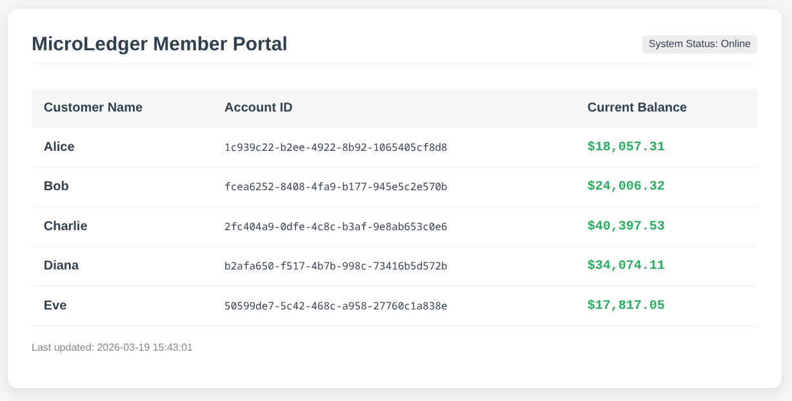

# MicroLedger: Multi-Language Banking Pipeline

MicroLedger is a localized banking simulation that demonstrates a complete data lifecycle. The project integrates **Python** for data generation, **Java** for core business logic and transaction processing, and **PHP** for a real-time member dashboard.



## Project Architecture

The system is divided into three distinct stages:

### 1. Data Generation (Python)
* **Account Generator (`accountGenerator.py`)**: Initializes a set of customers with unique UUIDs and random starting balances.
* **Transaction Generator (`transactionGenerator.py`)**: Simulates real-world activity by creating a queue of 10 random deposits and withdrawals based on existing accounts.
* **Storage**: Data is persisted in JSON format within the `data/` directory.

### 2. Core Banking Engine (Java)
* **Manual Parsing**: Instead of using external libraries, the system uses a custom-built Lexer in `Transaction.java` to parse raw JSON strings into Java objects.
* **Business Logic**: The `coreBankingSystem.java` processes the transaction queue. 
    * **Deposits**: Adds funds and applies a **1% Loyalty Bonus** for transactions over $1,000.
    * **Withdrawals**: Validates sufficient funds before deducting the balance.
* **State Management**: Updates the `accounts.json` file with new calculated balances.

### 3. Member Portal (PHP)
* **Dashboard**: A web interface that reads the processed `accounts.json` and displays a formatted ledger for bank members.
* **UI/UX**: Features conditional formatting (e.g., highlighting low balances) and currency styling.

---

## How to Run

### Prerequisites
* Python 3.10+
* Java JDK 17+
* PHP 8.0+

### Execution Steps
1.  **Initialize Accounts:**
    ```bash
    python src/python/accountGenerator.py
    ```
2.  **Generate Transactions:**
    ```bash
    python src/python/transactionGenerator.py
    ```
3.  **Process with Java Engine:**
    ```bash
    javac src/java/*.java
    java -cp src/java coreBankingSystem
    ```
4.  **Launch Dashboard:**
    ```bash
    cd src/web_dashboard
    php -S localhost:8000
    ```
    View the results at `http://localhost:8000`.

---

## Tech Stack
* **Backend Logic:** Java (Native String Manipulation)
* **Data Simulation:** Python (JSON, UUID, Datetime)
* **Frontend:** PHP, HTML5, CSS3
* **Data Format:** JSON
